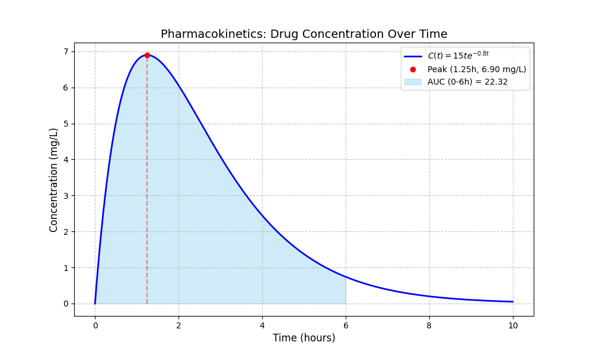

# Report: Pharmacokinetics Simulation

## Aim

This project explores how Calculus can be applied to Health Informatics, specifically in the field of Pharmacokinetics, which is the study of how drugs move through the body. The primary aim is to use a mathematical model known as the **Surge Function** to predict a drug's behavior over time. By applying calculus concepts like differentiation and integration, the project seeks to determine two critical metrics:
1.  **Peak Effectiveness:** The exact time when the drug concentration in the bloodstream is at its maximum.
2.  **Total Drug Exposure:** The total amount of the drug that the body is exposed to over a set period, calculated as the Area Under the Curve (AUC).

The overall goal is to demonstrate how these mathematical insights can help in optimizing drug dosages for better safety and effectiveness.

## Methods

The methodology involves both theoretical calculations and computational simulation.

### 1. Mathematical Model

The core of the project is the **Surge Function**, which models the drug concentration `C(t)` at a given time `t`:

`C(t) = A * t * e^(-k * t)`

- `A`: A constant related to dosage and absorption.
- `k`: The drug's elimination rate constant.
- `t`: Time in hours.

### 2. Calculus Application

- **Differentiation:** To find the time of peak concentration (`t_peak`), the derivative of `C(t)` is taken with respect to `t`, and the result is set to zero. This yields `t_peak = 1 / k`.
- **Integration:** To find the total drug exposure (AUC), the definite integral of the `C(t)` function is calculated over a specific time interval (e.g., from 0 to 6 hours).

### 3. Python Simulation

A Python script (`drug_simulation.py`) was developed to implement the model and verify the calculus-based findings. The script uses the following libraries:
- **`numpy`**: For efficient numerical operations and to generate time values.
- **`matplotlib`**: To create a visual plot of the drug concentration curve, the peak concentration point, and the AUC.
- **`scipy.integrate.quad`**: To perform the definite integration required for calculating the AUC.

The simulation calculates `t_peak`, the corresponding peak concentration `c_peak`, and the AUC. It then plots the concentration curve and saves the visualization as `concentration_graph.png`.

## Results

The results consist of the Python code used for the simulation and the graph it generated.

### Source Code (`drug_simulation.py`)

This is the script that runs the simulation, performs the calculations, and generates the graph.

```python
import numpy as np
import matplotlib.pyplot as plt
from scipy.integrate import quad

A = 15.0   
k = 0.8    
t_end = 10 

def concentration(t):
    return A * t * np.exp(-k * t)

if __name__ == "__main__":
    print(f"Concentration at t=1: {concentration(1):.2f}")

t_values = np.linspace(0, t_end, 500)
c_values = concentration(t_values)

t_peak = 1 / k
c_peak = concentration(t_peak)

auc_value, error = quad(concentration, 0, 6)

print(f"-"*30)
print(f"Calculus Verification:")
print(f"1. Peak Time (Max Concentration): {t_peak:.2f} hours")
print(f"2. Peak Concentration: {c_peak:.2f} mg/L")
print(f"3. Total Drug Exposure (AUC 0-6h): {auc_value:.2f} mg*hr/L")
print(f"-"*30)

plt.figure(figsize=(10, 6))

plt.plot(t_values, c_values, label=r'$C(t) = 15te^{-0.8t}$', color='blue', linewidth=2)

plt.plot(t_peak, c_peak, 'ro', label=f'Peak ({t_peak:.2f}h, {c_peak:.2f} mg/L)')
plt.vlines(t_peak, 0, c_peak, linestyles='dashed', colors='red', alpha=0.5)

t_fill = np.linspace(0, 6, 100)
plt.fill_between(t_fill, concentration(t_fill), color='skyblue', alpha=0.4, label=f'AUC (0-6h) = {auc_value:.2f}')

plt.title('Pharmacokinetics: Drug Concentration Over Time', fontsize=14)
plt.xlabel('Time (hours)', fontsize=12)
plt.ylabel('Concentration (mg/L)', fontsize=12)
plt.grid(True, linestyle='--', alpha=0.7)
plt.legend()

plt.savefig('concentration_graph.png')
print("Graph saved as 'concentration_graph.png'")

plt.show()
```

### Concentration Graph

The following graph was generated by the simulation. It visualizes the drug's concentration over 10 hours, highlighting the peak concentration time and the total drug exposure (AUC) over the first 6 hours.


